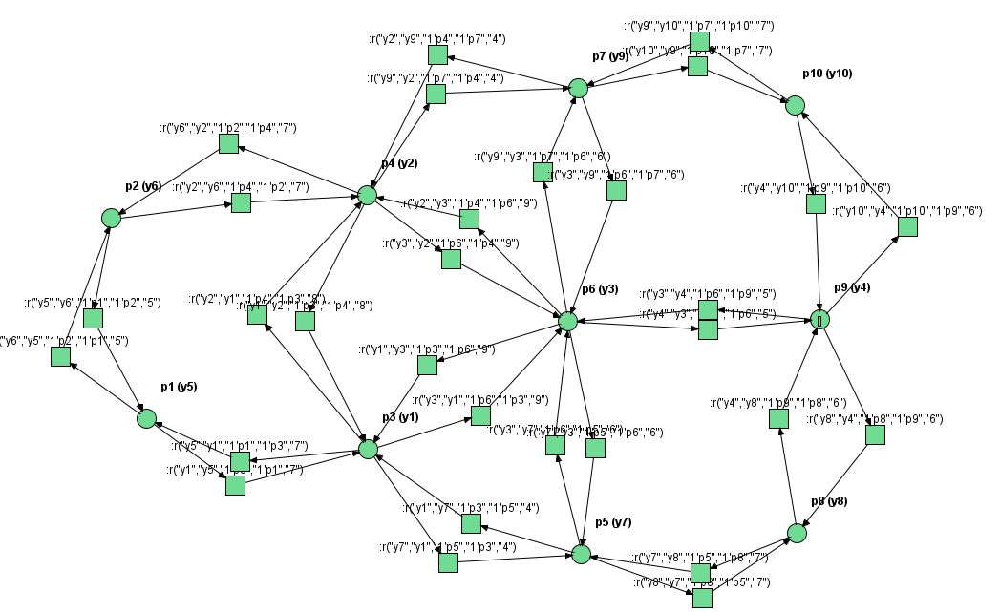
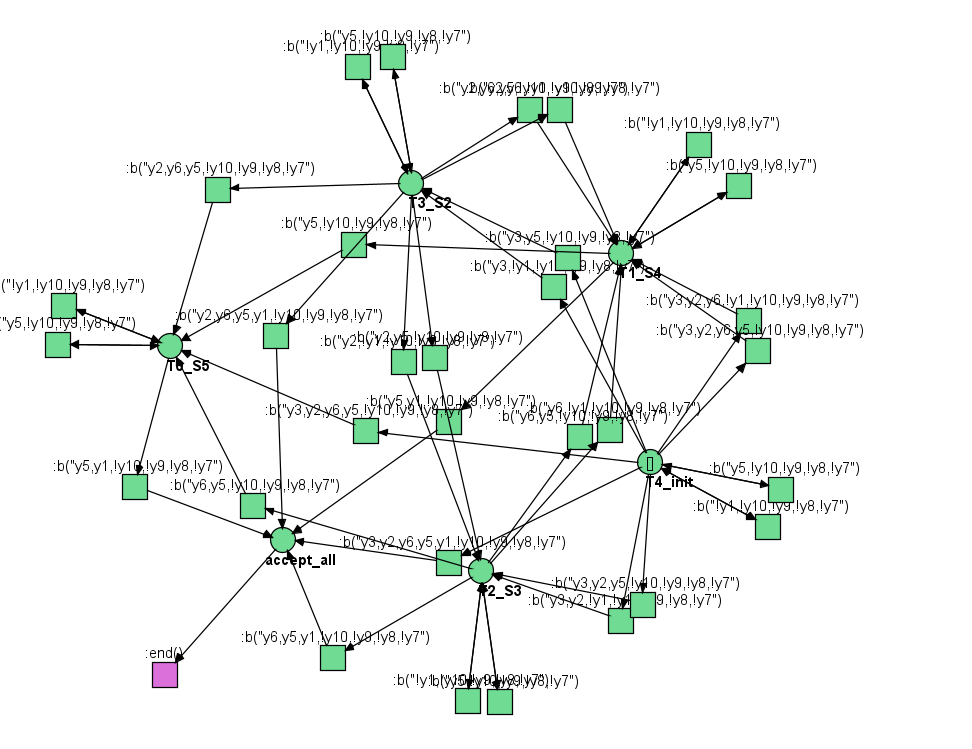

# Multi-Robot Trajectory Generation and Spurious Trajectory Detection

## About

This repository provides a comprehensive multi-robot trajectory generation tool with a combination of **Petri nets**, **LTL (Linear Temporal Logic)** specifications, and **Büchi automata** (written in Java). The repository also includes a **machine learning pipeline** for detecting spurious trajectories (written in Python), as well as **datasets** for testing and **low-level multi-robot planning simulations** using **VMAS** (for robust, coordinated robot planning).

The repository is organized into 4 main directories, each serving a specific purpose:

### Directory Structure

- **`datasets/`**: Contains datasets of trajectories with various behaviors and scenarios. Each scenario is accompanied by a README that explains the behavior and labels of the trajectories in the dataset.

- **`renew_petri_net_simulator/`**: Houses the Petri net simulator for trajectory generation. To launch the simulator, simply execute the appropriate file located in `/bin/` corresponding to your operating system. This simulator is used for generating Petri net-based multi-robot trajectories.

- **`vmas/`**: Manages the low-level robot simulator used to simulate tasks and robots. Inside this folder:
    - **`Task/`**: Sets up the environment and robots.
    - **`DatasetGenerator/`**: Defines the mission and simulates the task.
    To execute, run `Generate.py`, and simulation gifs will be saved in `code/saves/`.

- **`src/`**: Contains the code for the spurious trajectory classification pipeline and the NwN planner.
    - **`Robot_Petri_Net/`**: Contains code for generating robot Petri nets from a grid-based environment.
    - **`Specification_Net/`**: Generates Petri nets from an LTL specification.
    - **`Examples/`**: Provides example setups and configurations for trajectory generation.

---

## Features

- **Multi-Robot Trajectory Generation**: Utilize Petri nets and Büchi automata to plan coordinated robot trajectories under LTL specifications.
  
- **Spurious Trajectory Detection**: A machine learning pipeline for identifying invalid or spurious trajectories in multi-robot planning scenarios.

- **Low-Level Robot Simulator**: The VMAS-based simulator for testing and simulating low-level robot actions and environments.

- **Customizable Trajectories**: The framework is flexible and allows users to generate and modify various trajectory scenarios.

- **Simulation Output**: GIFs of simulations are automatically generated and saved for easy visualization of results.

---

## Installation & Setup

### Requirements

- **Java**: Required for the Petri net simulator.
- **Python 3.7+**: Required for the machine learning pipeline and simulation components.
- **VMAS (Virtual Multi-Agent Simulator)**: Used for low-level simulation tasks.

---

### Launching the Renew Petri Net Simulator

1. Navigate to the `renew_petri_net_simulator/` folder.
2. In the `bin/` directory, find the folder corresponding to your operating system (e.g., `Linux/`, `Windows/`, `macOS/`).
3. Execute the appropriate file to launch the simulator.

For detailed guidelines on how to simulate on Renew, visit this: https://eva-robillard.github.io/

### Running the Low-Level Robot Simulator

1. Navigate to the `vmas/` directory.
2. Inside the `DatasetGenerator/` folder, launch the simulation script by running:

    ```bash
    python Generate.py
    ```

3. After running the simulation, GIFs showing the robot trajectories will be saved in `code/saves/`.

---

### Running the Spurious Trajectory Detection Pipeline

1. Navigate to the `src/` directory.
2. Ensure you have the required dependencies installed.
3. Prepare your data from the desired trajectories.
4. Launch the classification script.

---

## Example Outputs

### Multi-Robot Trajectories

Below are some example GIFs showing the resulting multi-robot trajectories generated by the simulator:

/code/saves/datasets/mall_VMAS/4_400/qualitative/0.gif)
*Example 1: Multi-robot coordinated planning*

### Robot Petri Nets

Here are some example images of generated robot Petri nets:


*Example 1: Robot Petri net*


### Specification Petri Nets

Below is an example of a specification Petri net generated from an LTL formula:


*Example: Petri net generated from LTL specification*

---


## Contributing

We welcome contributions to enhance the multi-robot trajectory generation and planning system. Feel free to fork the repository, submit pull requests, and provide feedback.
